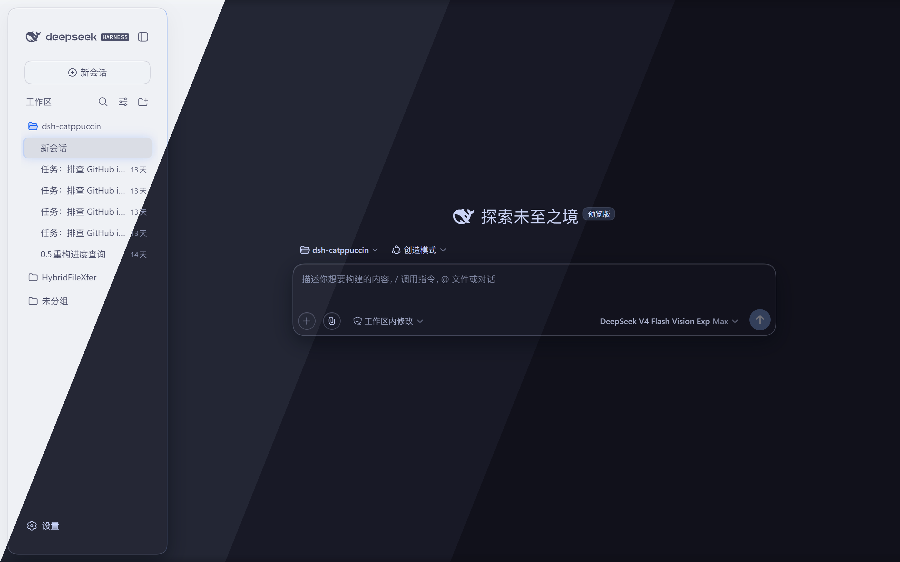
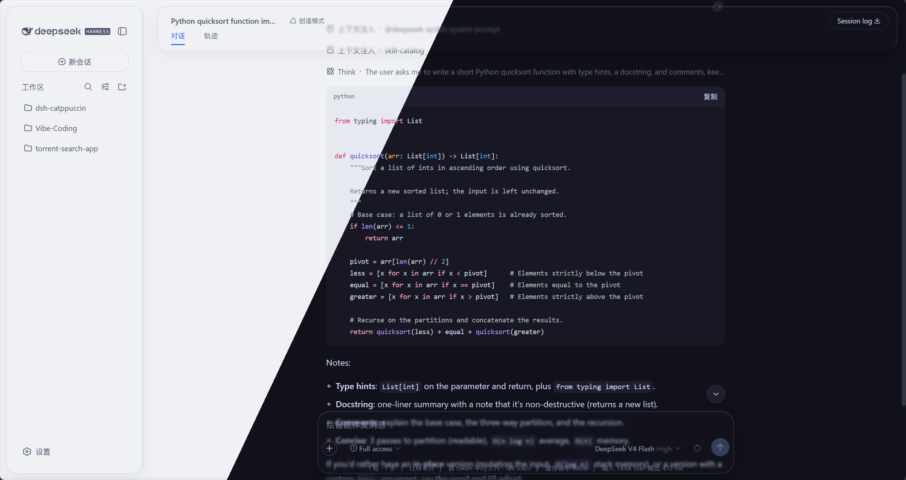
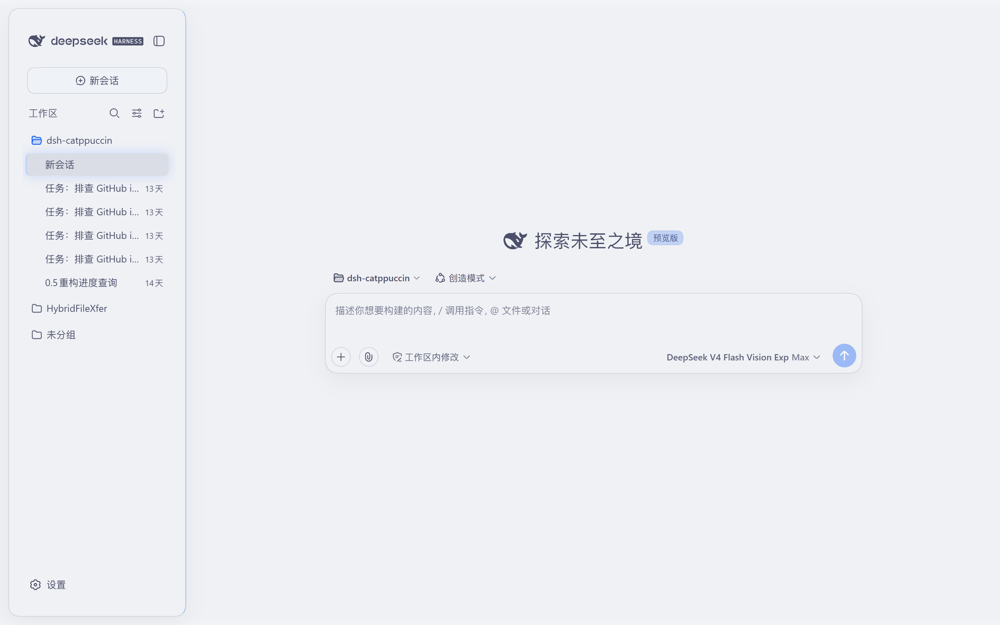
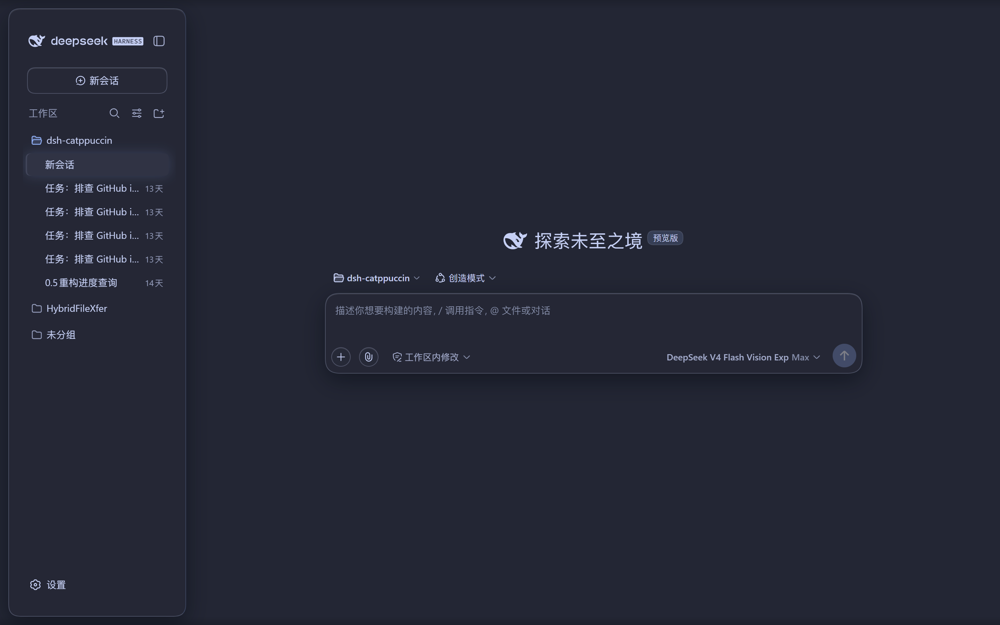
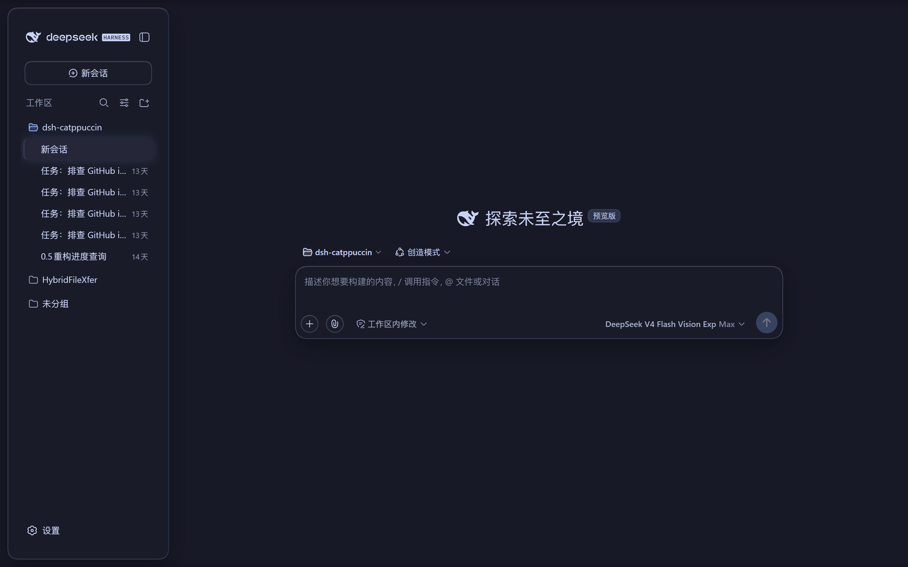
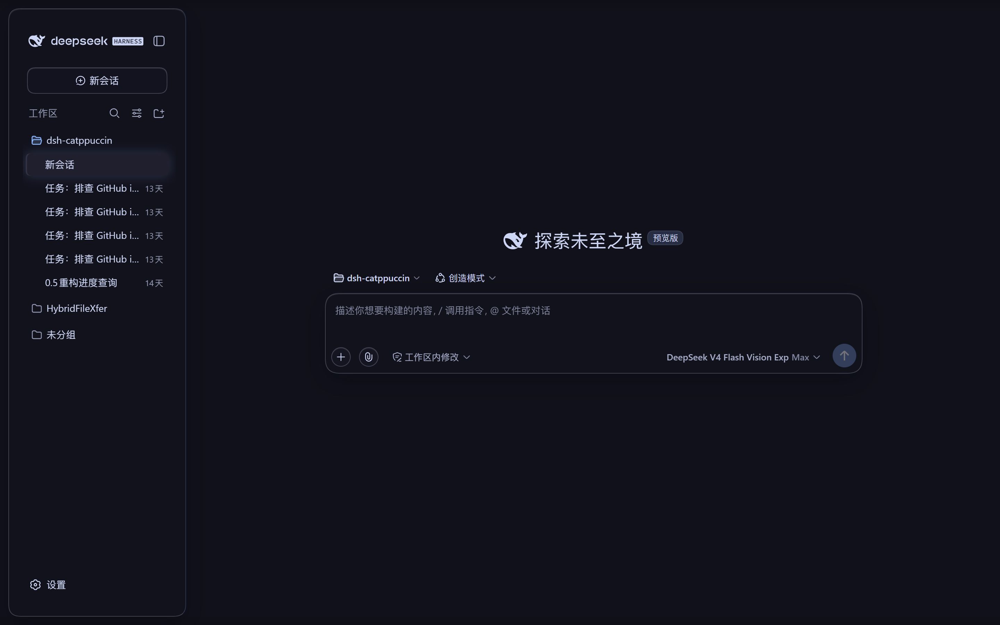
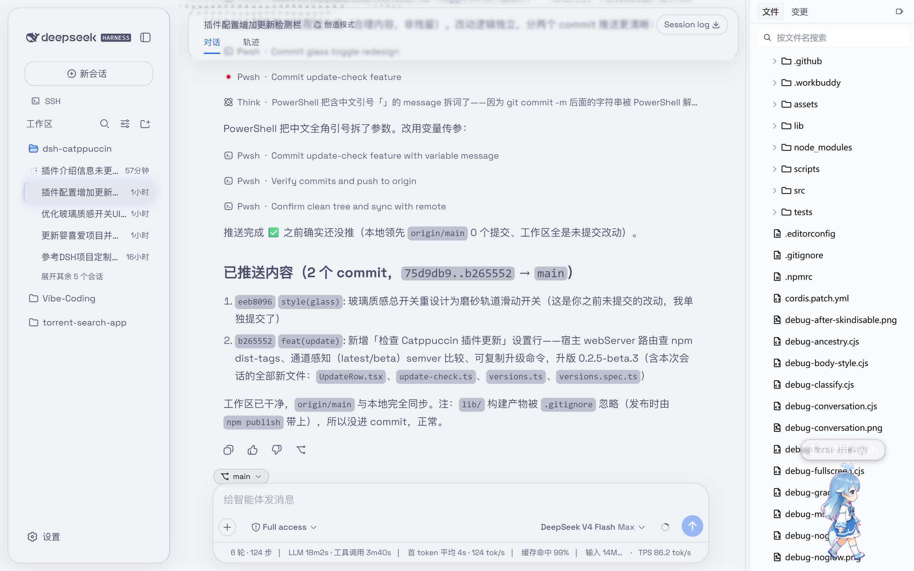
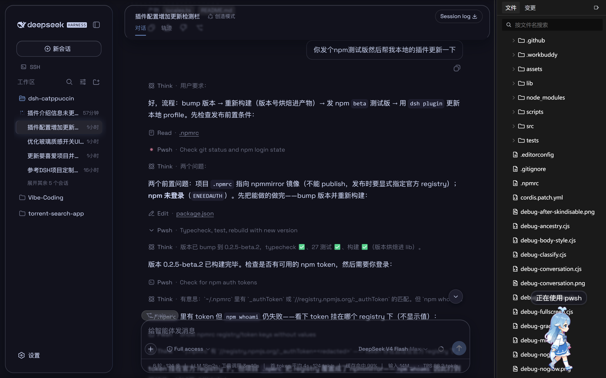

<h3 align="center">
	<br/>
	
	Catppuccin for <a href="https://github.com/deepseek-ai/deepseek-harness">DeepSeek Harness</a>
	
</h3>

<p align="center">
	<a href="https://github.com/NoNameLeGo/dsh-catppuccin-theme/stargazers"></a>
	<a href="https://github.com/NoNameLeGo/dsh-catppuccin-theme/issues"></a>
	<a href="https://github.com/NoNameLeGo/dsh-catppuccin-theme/contributors"></a>
	<a href="https://www.npmjs.com/package/@nonamelego/dsh-catppuccin"></a>
	<a href="https://www.npmjs.com/package/@nonamelego/dsh-catppuccin"></a>
</p>

**English** | [中文](README.md)

> A theme & glassmorphism plugin for [DeepSeek Harness](https://github.com/deepseek-ai/deepseek-harness) — Catppuccin flavours for the **Web GUI**, **DSH Desktop** and **dsh-TUI**, plus a switchable frosted-glass skin. Listed on [Awesome DSH Plugin](https://awesome-dsh-plugin.com/p/NoNameLeGo__dsh-catppuccin-theme/).

## Contents

- [Introduction](#introduction)
- [Features](#features)
- [Previews](#previews)
- [Installation](#installation)
- [Usage](#usage)
- [Glassmorphism](#glassmorphism)
- [Development](#development)
- [🙋 FAQ](#-faq)
- [💝 Credits](#-credits)

<p align="center">
	
	<br/><br/>
	
</p>

## Introduction

A [Catppuccin](https://github.com/catppuccin/catppuccin) theme plugin for
[DeepSeek Harness](https://github.com/deepseek-ai/deepseek-harness) — one package that fits
the **Web GUI** (`dsh web`), **DSH Desktop** and **dsh-TUI** alike: full recolouring plus a
glass skin on Web / Desktop, and the four official theme palettes auto-synced to the TUI.

It ships all four Catppuccin flavours — **Latte**, **Frappé**, **Macchiato**, **Mocha** —
remapping the whole interface to the matching palette, with a **Catppuccin** row right below
**Settings → General → Appearance** for one-click switching. Your choice is persisted and
restored after restarts.

It also includes an optional **glassmorphism** skin: the top bar, sidebar, composer,
stats line, trajectory view, chat bubbles and the new-session button become frosted-glass
cards, with adjustable blur, frost and backdrop brightness. Glass colours follow the active
Catppuccin theme automatically.

## Features

- 🎨 Four themes: Latte (light), Frappé / Macchiato / Mocha (dark)
- 🧩 Registered into the official theme system, on a par with the built-in light / dark / system themes
- 🎯 Full-UI colour coverage — not just one or two accent colours
- ⚙️ One-click switch in Settings, persisted and restored across restarts
- 🌐 Bilingual UI (Chinese / English, follows the system language)
- 🪟 **Glass skin**: frosted glass for the top bar / sidebar / composer / stats line /
  trajectory view / chat bubbles / new-session button, one-click toggle in Settings;
  mica & compatibility modes, adjustable blur, frost and backdrop brightness
  (interaction reference: [DSH-Transparent-UI-Plugin](https://github.com/WYH66666666/DSH-Transparent-UI-Plugin))
- 🌫️ **Glass details**: gradient blur bands at the top/bottom page edges, a floating glass
  rail when the sidebar is collapsed, a solid background in the theme's own base colour —
  content softens as it scrolls under the panes
- 🎨 Glass colours follow the current Catppuccin theme
- 🔄 **Update check**: one-click "Check for updates" in Settings compares the latest npm
  version and gives you a copyable upgrade command
- 💻 **dsh-TUI terminal themes**: one command installs into dsh-TUI; the four themes sync to
  `~/.dsh-tui/themes/` automatically (see [Installation · dsh-TUI](#dsh-tui-terminal-themes))

## Previews

Actual screenshots from a local GUI (the header image is a diagonal blend of the four):

<details>
<summary>🌻 Latte (light)</summary>

</details>
<details>
<summary>🪴 Frappé (dark)</summary>

</details>
<details>
<summary>🌺 Macchiato (dark)</summary>

</details>
<details>
<summary>🌿 Mocha (dark)</summary>

</details>

### Glass skin (Mica mode)

The frosted-glass effect in light (Latte) and dark (Mocha): the top bar, sidebar,
chat bubbles, composer and stats line are all glass cards; messages soften as they scroll
past the page edges; the background is the theme's solid base colour:

<details>
<summary>🌻 Latte (light glass)</summary>

</details>
<details>
<summary>🌿 Mocha (dark glass)</summary>

</details>

## Installation

### Option 1: from npm (recommended)

```sh
dsh plugin --profile web add @nonamelego/dsh-catppuccin
```

Restart `dsh web` after installing — `dsh plugin` adds it to the profile's bundles.
Use the profile name of your choice in place of `web` (e.g. `headless`).

**[DSH Desktop](https://github.com/anywhere-labs/deepseek-harness-desktop)**: the desktop build's
active profile is named `desktop`, so run:

```sh
dsh plugin --profile desktop add @nonamelego/dsh-catppuccin
```

Run it in the DSH terminal of the desktop app (`dsh plugin` defaults to the active profile).
Installing from the repo works the same way: `dsh plugin --profile desktop add https://github.com/NoNameLeGo/dsh-catppuccin-theme`.

### Option 2: from the repository

```sh
dsh plugin --profile web add https://github.com/NoNameLeGo/dsh-catppuccin-theme
```

When installing from git, pnpm may ask you to allow build scripts — follow pnpm's prompt
and add the package to the profile's `pnpm-workspace.yaml` `allowBuilds`, then run it again.

### dsh-TUI (terminal) themes

The same package covers the TUI. Install it into the dsh-tui profile:

```sh
dsh plugin --profile dsh-tui add @nonamelego/dsh-catppuccin
```

Installing from the repository works the same way (use the git form while the npm release
is pending). The package ships a tiny theme-sync plugin row
(`dsh-catppuccin-tui-themes`, no service dependencies): on every dsh-TUI start it syncs the
four theme JSONs to `~/.dsh-tui/themes/`, so upgrades pick up the new palettes. After
installing, launch `dsh --profile dsh-tui` and pick the theme with `/theme` —
**Catppuccin Latte / Frappé / Macchiato / Mocha**, or jump straight to it with
`/theme catppuccin-mocha` (your choice persists across restarts).

> 💡 Already installed the plugin for the Web GUI and also use dsh-TUI? No need to install
> it twice: every Web start auto-syncs the themes to `~/.dsh-tui/themes/` (only when the
> directory already exists).

> 📁 Prefer not to install the package? Copy `themes/*.json` into
> `~/.dsh-tui/themes/` (Windows: `%USERPROFILE%\.dsh-tui\themes\`) by hand — you just won't
> get updates automatically.

> ⚠️ `catppuccin-*.json` belongs to this plugin and is overwritten on sync; rename the files
> if you want custom themes.

> 💡 TUI themes only style the TUI itself — the terminal background is up to your terminal.
> Pairing it with the matching Catppuccin flavour (see the
> [Catppuccin ports list](https://github.com/catppuccin/catppuccin#-ports)) looks best.

## Usage

1. Open the Web GUI (default `http://127.0.0.1:3080`), or the DSH Desktop app.
2. Go to **Settings → General**.
3. Find the **Catppuccin** row below **Appearance** and pick a flavour:
   **Latte** (light), **Frappé**, **Macchiato** or **Mocha** (dark).
4. Choosing **Follow system** reverts to the official theme — it restores the preference
   you had before enabling Catppuccin (light / dark / follow system) instead of forcing a reset.

### Glass skin

Right below the **Catppuccin theme** row in **Settings → General** you'll find the **Glass** row:

- **Master switch**: on — the top bar, sidebar, composer, stats line and trajectory view
  become frosted glass; off — the UI reverts to stock instantly (no refresh needed).
- **Mode**: **Mica** turns the interface into floating frosted cards; **Compatibility** keeps
  the stock layout and swaps only the material.
- **Presets**: **Clear / Standard / Frosted** one-click presets; fine-tune with the sliders
  afterwards (a preset lights up when the current knob values match it).
- **Blur** (0–40 px) and **Frost** (0–100%): the blur radius and opacity of the glass.
- **Backdrop brightness**: dark mode darkens 0–50, light mode brightens 50–100 (50 = as-is),
  mixed straight into the solid background.

Glass colours follow the active theme live; all settings persist across restarts.

### Check for plugin updates

In **Settings → General**, right below the **Glass** row:

- Clicking **Check for updates** compares the latest npm version with the installed one:
  up to date → shows the current version; newer → shows the new version plus a copyable
  upgrade command (the profile name is detected automatically, falling back to `web`).
- Locally linked / source installs (`link:` / `file:` / git) don't show an npm upgrade
  command — you'll be told to `git pull` or rebuild instead.
- Channel policy: stable builds follow the `latest` tag; prereleases follow both `latest`
  and `beta` (the upgrade command automatically carries `@beta`). Offline or network
  failures show the reason and offer a retry.

## Glassmorphism

**Glassmorphism** is a visual style in which panels look like frosted glass — translucent
fills, backdrop blur (`backdrop-filter: blur()`), and glass details (rim, inner highlight,
soft shadow) — letting the content behind show through, softened.

What this plugin does:

- **Seven glass areas**: top bar, sidebar, composer, stats line, trajectory view, chat
  bubbles and the new-session button; in Mica mode they become rounded floating cards and
  chat content scrolls *under* the glass, blurred; the collapsed sidebar becomes a
  floating rail at the edge of the chat area;
- **Page-edge gradient blur**: a blur band at the top and bottom of the viewport so
  messages are softened as they melt past the edges (borrowed from
  [DSH-Transparent-UI-Plugin](https://github.com/WYH66666666/DSH-Transparent-UI-Plugin)'s
  Aqua skin);
- **Theme-following colours**: Latte is light glass, Mocha dark glass — switching flavours
  recolours instantly. The page ground is the theme's solid colour; the brightness knob
  mixes white/black straight into it;
- **One-click toggle**: off restores the stock UI exactly; uninstalling the plugin leaves
  nothing behind.

## Development

```sh
pnpm install
pnpm typecheck   # tsc --noEmit type check
pnpm test        # vitest palette-coverage tests
pnpm build       # tsdown build -> lib/index.js (host) + lib/client.js (browser)
```

Palettes are produced by a generator script — after editing
`scripts/generate-palettes.mjs`, rerun:

```sh
node scripts/generate-palettes.mjs
```

The changelog draft is generated from your conventional commits (bilingual `EN:` support
in commit bodies):

```sh
pnpm changelog:gen            # print the draft since the last tag
pnpm changelog:gen -- --write # write it into the [Unreleased] section
```

### Local link debugging

Clone the repo, link it into a profile and add it to the bundles (use your own paths):

```sh
pnpm --dir C:\Users\LeGo\.dsh\profiles\web add link:D:\Vibe-Coding\dsh-catppuccin
```

Then add `@nonamelego/dsh-catppuccin` to the profile's `package.json`
`dsh.profile.bundles` and restart `dsh web`. For DSH Desktop use
`~/.dsh/profiles/desktop` instead.

## 🙋 FAQ

- **Q: "Why don't I see the Catppuccin themes in the Appearance row?"**\
  A: The stock Appearance row only lists the built-in light / dark / follow-system
  preferences. The four flavours live in the **Catppuccin** row right below it.
- **Q: "How is my theme choice remembered?"**
  A: The choice persists in DSH's official settings document (the `catppuccin` namespace,
  stored under the DSH home, shared across every DSH instance on the machine), with
  localStorage as an in-browser cache and cross-tab sync. So plain `dsh web`,
  `dsh web --port <custom>`, and **DSH Desktop** (which boots on a fresh random loopback
  port every launch) all restore the preference automatically. The glass switch and every
  knob persist the same way. Since 0.5.0, a legacy `catppuccin-state.json` is migrated
  into the settings document once on first launch (the file is kept as a rollback copy).
- **Q: "How do I know if this plugin has a new version?"**
  A: Settings → General → **Check Catppuccin plugin updates** compares against npm in one
  click and gives a copyable upgrade command; or run
  `dsh plugin --profile web update @nonamelego/dsh-catppuccin` manually (re-`add` the
  latest version works too). In [DSH Desktop](https://github.com/anywhere-labs/deepseek-harness-desktop),
  use `desktop` as the profile name, or just run `dsh plugin update` in the app's DSH terminal.

## 💝 Credits

- [Catppuccin](https://github.com/catppuccin/catppuccin) for the palettes and port templates
- [DeepSeek Harness](https://github.com/deepseek-ai/deepseek-harness) for the plugin system
- [DSH-Transparent-UI-Plugin](https://github.com/WYH66666666/DSH-Transparent-UI-Plugin)
  for the glass-skin interaction and implementation reference (mica / compatibility modes,
  blur / frost / brightness knobs)

&nbsp;

<p align="center">
	
</p>

<p align="center">
	Copyright &copy; 2021-present <a href="https://github.com/catppuccin/catppuccin" target="_blank">Catppuccin Org</a>
</p>